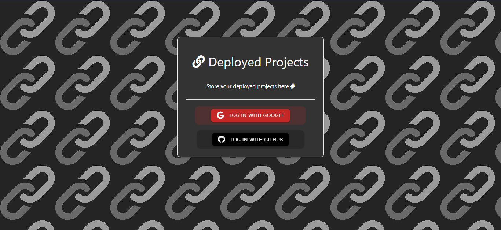
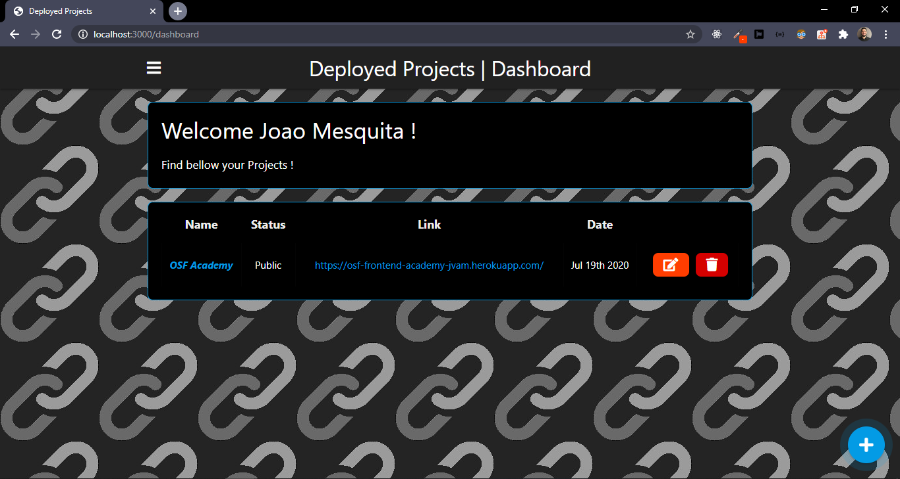
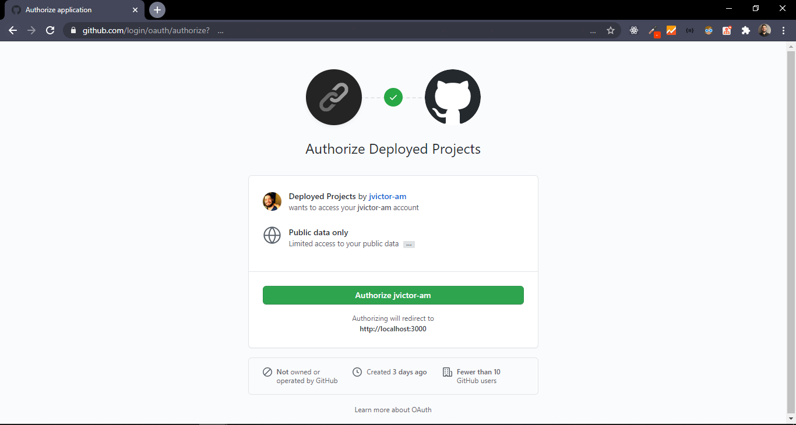
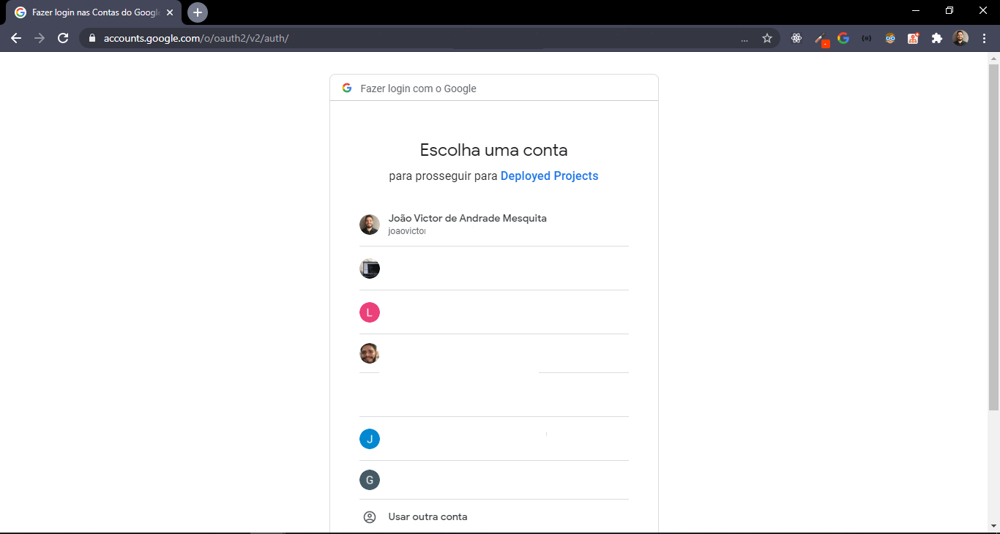
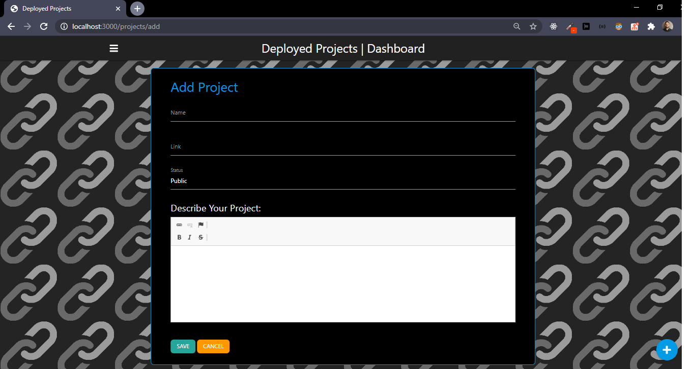
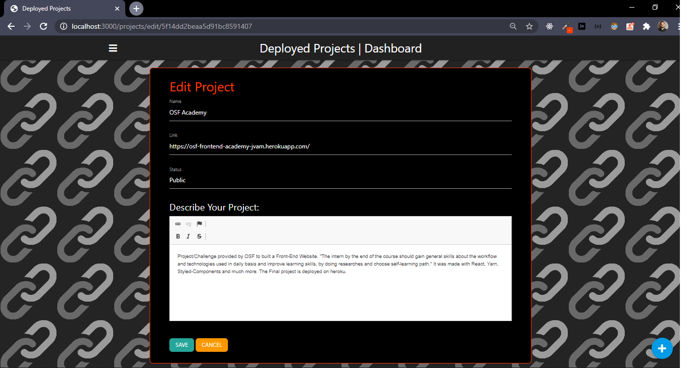
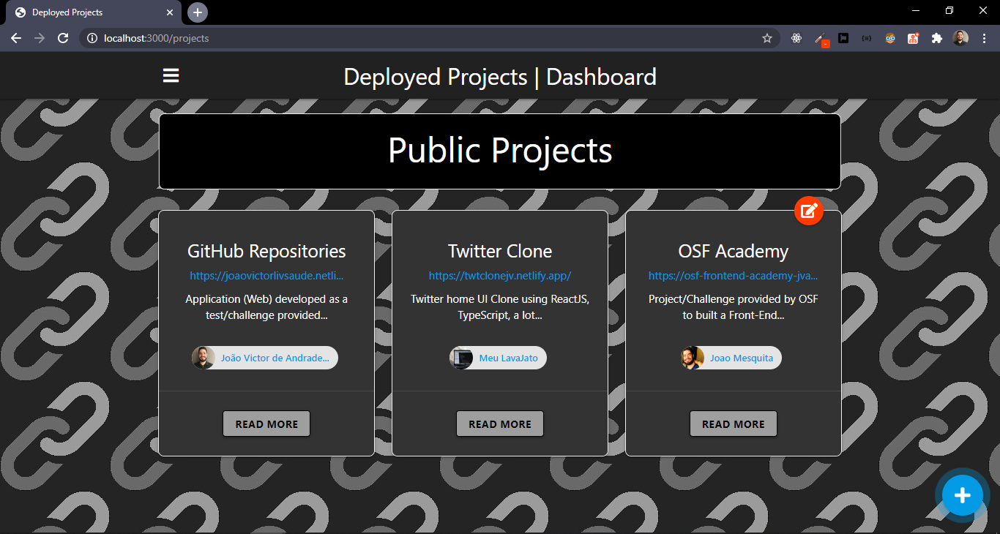
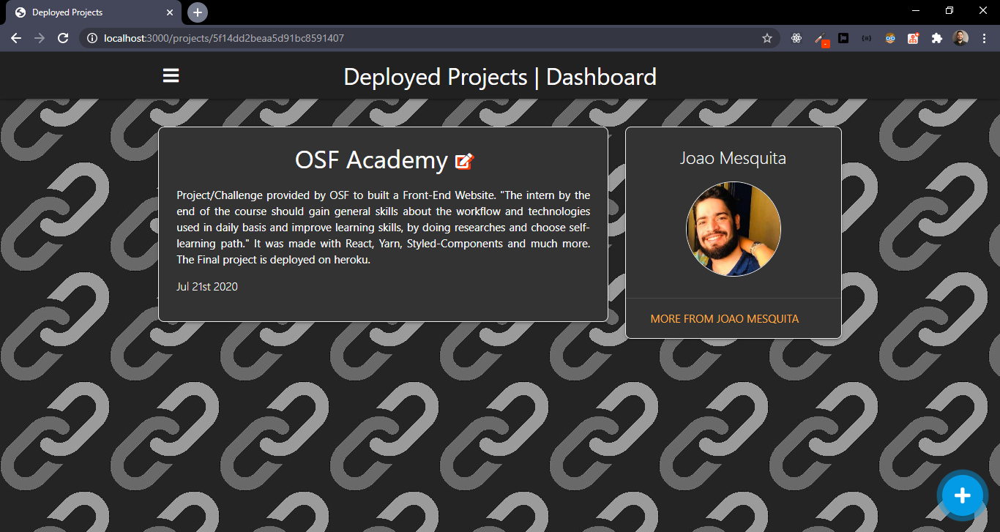
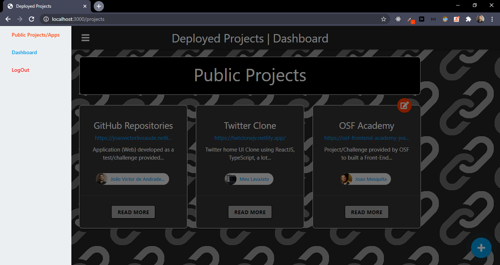
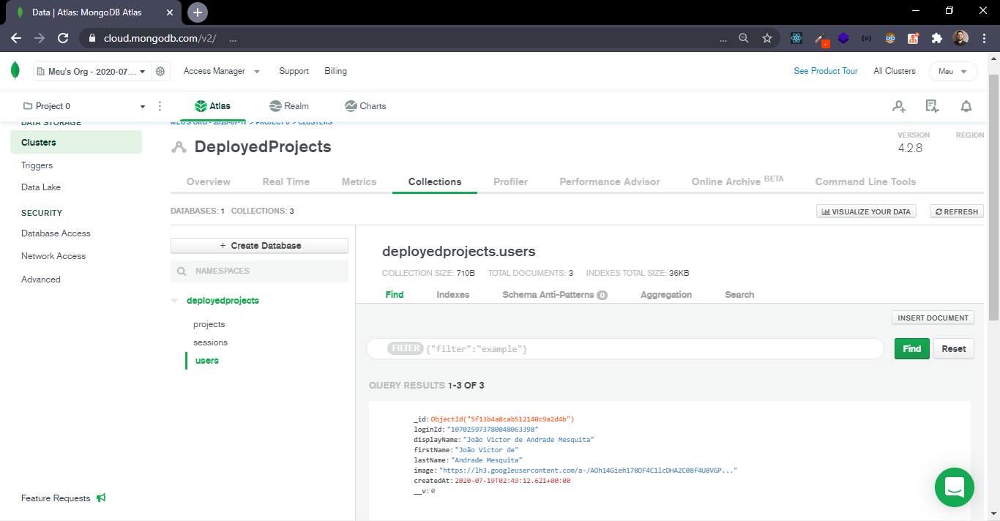

<h1 align="center">
  
</h1>

<h2 align="center">
  Deployed Projects Store
</h2>

## :computer: About

Server-side application developed using NodeJS, MongoDB, Express, Handlebars and much more. <br>
We are able to login with Google and GitHub accounts using <strong><i>oAuth 2.0</i></strong>, store as many Projects with description and link as you want, check public 
projects, etc. The focus was also to learn and practice the language, tools, etc. It was based on original tutorial provided by [Brad Traversy](https://www.youtube.com/watch?v=SBvmnHTQIPY); 
Thank you for the great content man, very helpful. I put my own 'black' styling and also implemented GitHub oAuth 2.0.

## Built with:

- Node (v12.16.1)
- NPM (6.13.4)
- Express: (^4.17.1)
- connect-mongo: (^3.2.0)
- mongoose: (^5.9.24)
- express-handlebars: (^5.1.0)
- passport: (^4.0.3)
- passport-github: (^1.1.0)
- passport-google-oauth20: (^2.0.0)
- materialize: (1.0.0)
- font-awesome: (5.14.0)
- ckeditor: (4.14.1)
- ...

## :framed_picture: :computer: Application Screens

<h3 align="center">
  


<details><summary><b>More Screens</b></summary>
  









</details>
</h3>

## How to install and run on your computer:

<strong>1. Clone this project and install dependencies</strong>

```
$ git clone https://github.com/jvictor-am/Deployed-Projects-Store.git
$ cd Deployed-Projects-Store
$ npm install
```

<strong>2. Create a .env file inside config paste and fill the variables as showed in .env.example file.</strong>
<p>For more information to configure IDs and SECRETs you can check the tutorial I pointed on About section.</p>

```
PORT = 3000

MONGO_URI = ?

GOOGLE_CLIENT_ID = ?

GOOGLE_CLIENT_SECRET = ?

GITHUB_CLIENT_ID = ?

GITHUB_CLIENT_SECRET = ?
```

<strong>3. Run on localhost:3000</strong>

```
$ npm run dev
```

<strong>4. Open your browser and access http://localhost:3000. You should by now see the Login page!</strong>

</br>

---

# Author

[**João Victor**](https://www.linkedin.com/in/jo%C3%A3o-victor-de-andrade-mesquita-848a09122/)

<h2 align="center">
  Thank You!
</h2>
